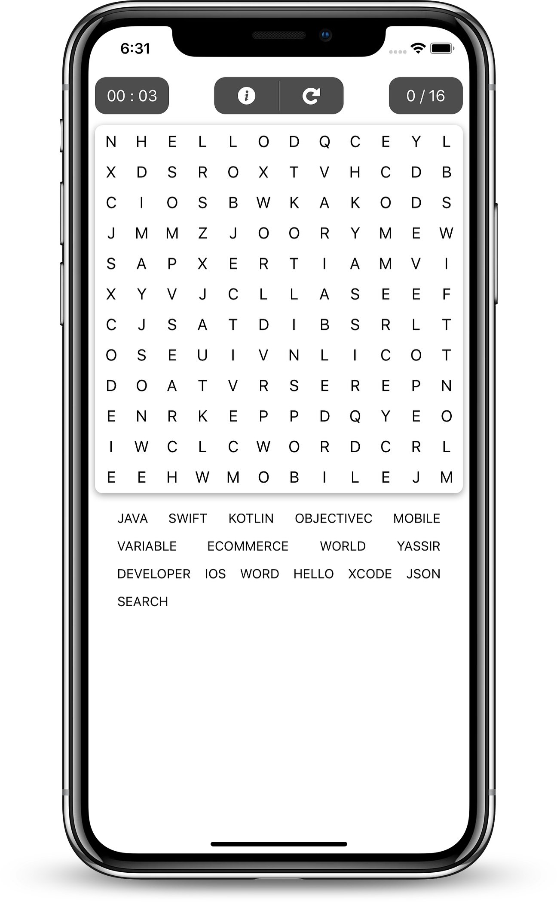
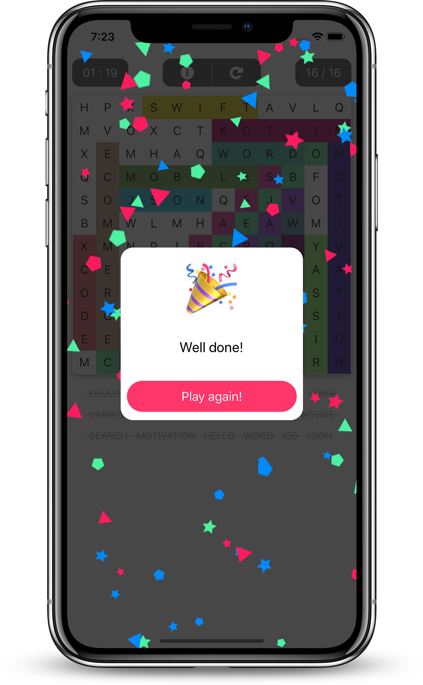
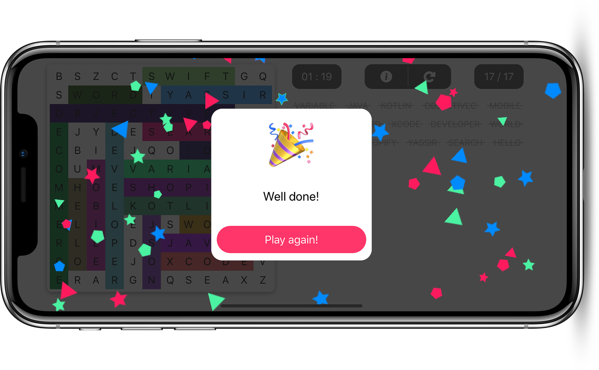

# WordSearch : Shopify Mobile Developer Intern Challenge

# Preview

## Requirements
* [x] A word search mobile app.
* [x] The word search should have at least a 10x10 grid. (**has 12x12 grid**)
* [x] Include at least the following 6 words: Swift, Kotlin, ObjectiveC, Variable, Java, Mobile. (**in addition to words from data.json**)
* [x] Keep track of how many words a user has found. (**with a score and a word list**) 
* [x] Make sure it compiles successfully.

## Suggested Bonus
* [x] Randomize where the words are placed.
* [x] Make a slick UI with smooth animations. (**animation on success with confetti, animated custom alert view ...**)
* [x] Make it look good in portrait and landscape. (**changing the position of the words list for better look**)
* [x] Allow the user to find the words by swiping over the words.

## Extra Bonus
* [x] Displaying score (**nb found / nb words**)
* [x] Timer score (**nb found / nb words**)
* [x] Words' list with dashed found words.

